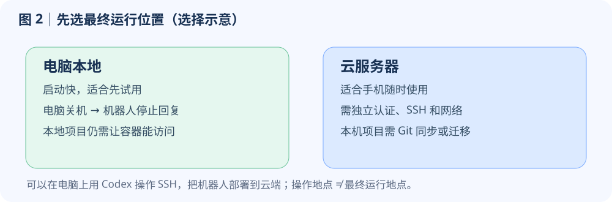
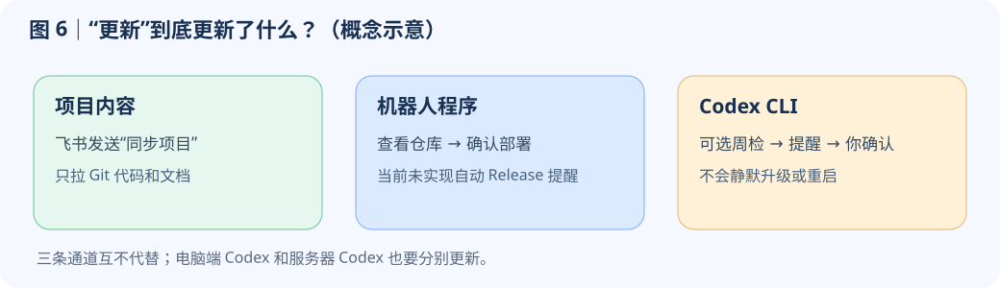

# Codex 飞书机器人：从零开始使用

这份手册只讲 **Codex 飞书机器人**；秋招看板是另一个独立产品。你不需要先懂 Docker、Git 或飞书开放平台。文中的图片是界面或流程示意，不是你的飞书租户真实截图。

## 先判断：这种用法适合你吗？

如果你已经在电脑上用 Codex，这个机器人**不是更强的 Codex，也不是自动同步所有电脑资料的新账号**。它增加的是一个飞书入口：你可以在常用聊天窗口交代任务、补充要求，接收文字、图片、文件或飞书文档链接；机器人在你指定的电脑或服务器上执行。比较适合这几种情况：

- 想在手机飞书里随时发起或跟进一项工作，不必坐在开发电脑前；如果机器人装在一直在线的服务器上，电脑关机也能继续使用。
- 原本就用飞书收资料、讨论工作，希望截图、附件和处理结果留在同一段聊天里，方便继续追问。
- 想把不同代码或文档按“项目”和“任务”分开处理，并明确控制它在哪台机器、哪份文件中工作。

也有你**未必需要它**的情况：如果只是想从手机继续操作自己电脑上的 Codex，OpenAI 官方也提供 [Remote 连接方式](https://learn.chatgpt.com/docs/remote-connections)；在账号与设备支持的情况下，它可直接使用该电脑上的项目和会话，无需为此单独维护飞书机器人。若你不想管理飞书应用、运行机器和权限，也应先评估这种额外维护是否值得。

它的工作方式很简单：你在飞书发消息 → 机器人交给运行在**你自己电脑或服务器**上的 Codex → Codex 在被授权的工作区处理 → 结果发回飞书。


它能修代码、读项目、分析截图、整理文档和生成文件，但**不会自动知道你电脑上的所有文件**。能看到什么，取决于运行位置、当前项目和权限。第一次可以发：

```text
请介绍你现在能访问哪个项目。先只读检查，不要修改文件。
```

给任务时尽量说清**对象、目标、完成标准、限制**。例如：“在‘我的网站’项目里检查登录页为什么打不开；先定位原因，修复后跑测试，暂时不要部署。发现需要删除数据时先问我。”不知道如何描述时可先发“帮我把需求拆成步骤，先不要执行”。复杂任务建议分成“先分析 → 确认方案 → 修改 → 验证 → 部署”。工作进行中可以补充要求；要停下就发 `暂停`。暂停**不会撤销**已经写入的文件。

## 1. 先选：装在电脑上还是服务器上？

两个选择都能用飞书聊天，区别在于**机器人实际在哪里运行**，不是你从哪台电脑发起安装。



**先在电脑本地运行**：适合试用，特别是你已经在这台电脑登录 Codex。电脑关机后机器人就不能回复；项目目录也仍需对容器开放访问。

**直接放在云服务器运行**：适合希望手机随时可用的人。服务器要保持在线，并单独配置 SSH、Codex 认证和项目文件；它不能自动读取你电脑上的文件。

**完全新手建议**：先在自己的 macOS/Linux 电脑完成一次本地部署和飞书私聊验收，再决定是否迁到云端。已经有服务器，也可以让本地 Codex 通过 SSH 帮你在云端部署；“在本地操作”不等于“机器人最终运行在本地”。

如果使用 Windows，公开仓库推荐的 Docker 主路径需要 Linux 环境；先用 WSL2/Linux 或云服务器，不要把 macOS/Linux 的 Bash 命令直接粘到 PowerShell。仓库中有维护者使用的 Windows 脚本，但不是本文的通用一键安装路径。

## 2. 第一次配置：你做什么，助手做什么

### 安装前只需准备

1. 一个能正常使用的 Codex 账号，和可以正常登录的飞书账号；企业租户可能需要管理员审批。
2. 一台符合上节选择的机器。推荐准备 Docker（macOS 可用 OrbStack）、Node.js 22+、pnpm、Google Chrome，并确认本机 Codex 能回答一条消息。
3. 如果选择云端，再准备可 SSH 登录的 Linux 服务器。**不要把服务器密码、飞书密钥或 Codex 登录文件发到公开聊天，也不要放进 Git 仓库。**

飞书开放平台将建立一个你自己的“企业自建应用”。机器人用飞书**长连接**收消息，所以本地试用不需要公网域名或回调地址。你必须亲自完成登录、扫码、二次验证或管理员授权；普通页面配置可以交给 Codex/WorkBuddy。

### 路线 A：先在本机跑通（推荐第一次使用）

**第 1 步｜打开 Codex 或 WorkBuddy。** 在电脑里新建一段对话，确认它能使用终端和浏览器。不要先在飞书里向还没安装的机器人发安装命令。

**第 2 步｜把仓库交给它。** 把下面这段完整发给 Codex/WorkBuddy：

```text
请在我的电脑上部署这个开源项目：
https://github.com/2609086461/codex-feishu-bot

先阅读仓库的 AI_SETUP.md、AGENTS.md、README.md、SECURITY.md、
docs/codex-bootstrap-playbook.md 和 docs/feishu-console-automation.md。
目标是“本机 Docker 运行 + 飞书私聊可用”。先问我是否创建新机器人；
其余环境检查、飞书控制台配置、启动与验收尽量由你完成。
登录、扫码、管理员审批时提醒我接手。不要在聊天里显示密钥，
不要把真实凭据提交到 Git，也不要把源码目录当作工作区。
完成后告诉我：机器人名称、运行位置、验收结果和停用方法。
```

**第 3 步｜回答“新建还是复用”。** 助手应先问是否创建新机器人。第一次通常选“新建”；已有你自己的飞书应用、且确认不会影响现有服务时选“复用”。若列出多个候选应用，自己指定目标，不要让助手猜。

**第 4 步｜按提示登录。** 助手可能打开飞书开放平台专用 Chrome 窗口，也可能给出扫码提示。你只负责登录、2FA、管理员批准。不要在飞书聊天或公开截图中粘贴 App Secret。

**第 5 步｜等待自动检查。** 助手会创建私有配置、配置机器人能力和长连接事件、发布应用版本、启动 Docker，并做健康检查。它应向你报告“服务健康”和“飞书私聊收发成功”；只有命令退出成功，不代表消息已经打通。

**第 6 步｜自己验收。** 在飞书里找到新机器人，私聊发送：

```text
你好。请告诉我当前项目和模型，先不要修改文件。
```

收到正常回复才算完成。接着发 `项目`，确认项目卡片能打开。示意如下：


如果没有回复，把“发送时间、是否私聊、是否收到错误卡片”告诉部署助手；按第 10 节排查，**不要反复新建飞书应用**。

### 路线 B：在本地用 Codex，把机器人部署到云服务器

这条路线的操作入口仍在你电脑上，但最终运行机器是服务器。准备好服务器 SSH 登录后，把路线 A 的提示词改成：

```text
请阅读 https://github.com/2609086461/codex-feishu-bot 的 AI_SETUP.md
及相关部署文档，用我电脑上的 Codex 协助配置飞书应用，
但最终把机器人部署到我指定的 Linux 服务器。先只读检查服务器
环境和现有服务；不要覆盖已有机器人、工作区或凭据。
部署后在服务器运行健康检查，并让我从飞书私聊做最终验收。
本机登录态不要直接提交到 Git；如需服务器 Codex 认证，请说明
安全的单独登录/传输方式，让我决定。
```

云端至少需要 Docker、能拉取代码的 Git、能访问飞书/OpenAI 的网络，以及服务器自己的 Codex 认证。**电脑端已经登录 Codex，不表示服务器也登录了；电脑端模型列表也不等于服务器模型列表。** 建议先让助手报告实际缺项再安装，不要照抄别人机器的路径。

### 路线 C：已经本地跑通，后来想搬到云端

可以迁移，不需要再创造一个全新产品。推荐顺序：

1. 在云端备好机器、独立认证、工作区和同一版本代码；让助手只读检查本地和云端状态。
2. 要复用的项目文件通过**私有 Git 仓库**同步，或用安全传输单独迁移。不要把 `.env.real`、Codex 登录态、SSH 密钥放进 Git。
3. 如复用原飞书应用，安全地把它的配置转到服务器。**先停本地机器人，再启云端机器人**，避免同一应用同时有两份服务争抢消息。
4. 在服务器做健康检查，再从飞书私聊验收。确认云端稳定后，才决定是否清理本地环境。

迁移项目文件与迁移旧对话不是一回事。旧 Codex 会话可能依赖原机器的路径和会话目录；**不要承诺旧聊天自动跟着搬家**。最稳妥的是云端重新“绑定项目”，把长期规则写进项目的 `AGENTS.md`、文档或仓库 skill。确需保留原任务上下文时，先让助手列出会话数据与路径映射的迁移方案，备份后再实施。

## 3. 日常使用：项目、任务和“记忆”

可以把它理解成：**项目 = 一份可操作的资料/代码目录；任务 = 这份项目里的一段独立对话**。


### 没有项目，也能先聊天

首次私聊会处在“临时工作区”的默认任务。问答、读图片都可以开始。但长期资料、改代码或多人协作，最好切到明确项目，以免机器人在错误文件夹做事。

### 新建一个空白项目

发 `项目` → 点击“＋新建项目” → 输入名称；或者直接发 `新建项目 毕业设计`。机器人会建立独立工作目录并切入“默认任务”。适合从零整理文档。以后发 `项目` 点击名称，或发 `项目 毕业设计` 切换。任务运行中不能切项目，等完成或暂停后再切。

### 把现有 GitHub/GitLab 仓库交给机器人

如果已有代码，别新建空白项目再手工上传。确认仓库内没有密码或登录态等敏感文件，然后发送：

```text
绑定项目 我的网站 https://github.com/你的账号/你的仓库.git main
```

机器人会克隆仓库到自己的运行工作区并记录分支。私有仓库需**在机器人运行机器上**先配置仓库访问权限；不要把令牌写进 URL。之后电脑端把改动推到 GitHub，飞书里发 `同步项目`，机器人才会拉到新代码。发 `项目` 可看到当前选中项。

**`同步项目` 只拉取，不上传。** 如果机器人工作区有未提交改动，或者当前分支不对，它会停止，保护文件。遇到提示，先发“检查当前项目的 Git 状态，告诉我有哪些未提交改动，不要覆盖”。确认以后再决定提交、推送或另行处理。

### 怎样复用电脑端 Codex 的项目和项目记忆？

**复用项目文件**：将代码和普通文档放入私有 Git 仓库，机器人用 `绑定项目` 接入，再用 `同步项目` 拉取。电脑上还没推送的修改不会自动出现在云端。

**复用长期规则**：把适合共享的背景写入项目的 `AGENTS.md`、README 或仓库 skill，提交后同步。新任务不会自动记得别的任务里随口说过的每句话。

**复用旧聊天**：只有机器人与原 Codex 处于同一运行环境，且会话数据和项目路径都可访问时，旧对话才可能出现在“项目/任务”列表里。绑定 Git 仓库不会把电脑上的聊天记录上传到云端。

机器人即使和电脑 Codex 使用同一个账号，**也不等于共享本机文件、项目列表或会话**。Docker 容器还必须能访问项目真实路径；云服务器则必须先同步或迁移文件。看到“本地 Codex 项目”标签，也要检查能否实际读取文件，别只看名称。

### 为同一个项目新建独立任务

比如在“我的网站”项目下分别发 `新建任务 修复登录页` 和 `新建任务 写部署文档`。发 `任务` 可查看和点击切换；也可以发 `任务 修复登录页`。切回来会继续那段对话。**新任务没有另一个任务的对话上下文，但两者操作同一套项目文件。** 因此重要背景请写到项目文档；让两个任务同时改同一文件时先划清范围。

## 4. 模型、思考强度、过程显示

最简单的用法是发 `模型`。机器人会根据**它当前运行环境里的 Codex 账号**列出可用模型。卡片中选“自动”最省心；若需自己指定，先选模型，再选该模型支持的思考强度。也可发 `切换模型 模型名称`，或发 `思考 高`。手动设置对**下一项任务**生效；正在执行的任务不会中途换模型。


一般整理/轻改动用自动；大型重构或复杂排错再手选更强模型。列表会随账号权限和 Codex 版本变化，**不要照抄别人截图里的模型名称**。电脑端看得到而机器人看不到时，先核对机器人所在机器的账号与 CLI 版本，再发 `模型` 刷新；不一定是模型坏了。

`过程 开` / `过程 关` 控制是否显示机器人提供的过程摘要；它不改变项目文件，也不是把模型内部全部思考内容公开。想少看中间消息可以关掉。

## 5. 图片、附件与文件交付

把图片或文件直接发给机器人，并说明要做什么，例如“这张报错截图帮我定位问题，先别修改”。机器人会把附件放在当前项目可访问的工作区再处理。文件很大或内容敏感时，先确认运行位置与权限。

如果要收到报告、表格、图片或压缩包，直接说“完成后把文件发回飞书”。**机器人工作区里的路径不是下载链接**；只有真正通过飞书发送的文件，你才在聊天里看得到。让它创建飞书云文档时，要求返回可打开的文档链接并确认权限。

## 6. 更新、备份和云端同步：三件不同的事



### A. 更新项目内容：你自己随时发 `同步项目`

这只更新当前绑定的 Git 项目，不更新机器人程序，也不更新 Codex CLI。它使用安全的快进拉取；有未提交修改会停止。项目文件在 GitHub 的共享是“代码/文档同步”，**不是飞书聊天实时云同步**。

### B. 更新机器人程序：查看仓库版本，确认后部署

机器人程序更新来自 [GitHub 仓库](https://github.com/2609086461/codex-feishu-bot) 的版本或提交。**当前仓库尚未实现每个实例自动检测机器人 Release 并主动提醒的完整流程**；不要仅凭旧手册认为它会自动推送更新。你可以定期看仓库 Release，或在飞书里说：“请先只读检查 Codex 飞书机器人仓库有没有新版本，告诉我变更、兼容风险和备份计划；未经我确认不要升级。”

确认后再明确说“升级机器人程序”。助手应先检查工作区有无改动，备份私有配置与运行状态，跑测试，再部署并用飞书私聊验收。**机器人程序更新不等于重建飞书应用或清空聊天。** 生产机器人若要替换自己，需使用仓库的自部署流程，不能在当前容器里直接运行普通 `docker compose up`。

### C. 更新 Codex CLI：可选的每周提醒，不自动升级

Codex CLI 是机器人调用 Codex 的运行组件；更新它可能影响模型列表。仓库提供了**可选**的服务器定时检查器：部署者安装后，每周日 04:00（北京时间）检查 npm 稳定版，发现新版本才发一次提醒，**不会自行安装或重启**。未安装定时器，就没有这项自动提醒。

收到提醒后，先让机器人说明当前版本、新版、风险和测试，再决定是否升级。你可以发“确认升级 Codex CLI”，但这句话是给助手的授权，**不是无需检查就自动执行的内建按钮**。完成后发 `模型` 查看实际列表。**电脑端 Codex、机器人运行机的 Codex CLI 是两份安装。** 电脑端升级不会自动改服务器端。

## 7. 备份、权限与多人使用

机器人可能运行终端、读取项目和修改文件；只授权给可信的人。默认只处理私聊，允许用户由部署名单控制；开启群聊或加人前，先想清楚他们能访问哪些项目和服务器资源。当前 Docker 部署授予容器较高宿主机权限，**不要当作可对陌生人开放的公共机器人**。

重要资料推荐两份保护：项目代码/可共享规则放私有 Git；机器人私有配置、运行状态和未同步工作区做单独备份。密钥、Codex 登录态、浏览器配置、SSH Key、聊天快照**不要提交到 Git**。公开截图时给 App Secret、邮箱、个人简历、仓库令牌打码。

## 8. 常用消息速查

**先选工作位置**：发 `项目` 查看和切换项目；发 `新建项目 项目名` 建空项目；已有 Git 仓库则发 `绑定项目 名称 仓库地址 [分支]`。以后想拉最新代码，发 `同步项目`。

**再选对话**：发 `任务` 查看和切换当前项目里的任务；发 `新建任务 任务名` 开一段独立对话。

**调整回答方式**：发 `模型` 选择自动或手动模型；需要时发 `思考 高`、`过程 开` 或 `过程 关`。想中断正在执行的工作，发 `暂停`。

菜单可以点击卡片；如果客户端不方便点，通常也能在短时间内回复序号。序号是**临时选择**，过期就重发 `项目`、`任务` 或 `模型`，不要隔几天直接发旧序号。

## 9. 照着做：三个典型场景

**场景 1｜电脑上的网站项目，想在手机飞书继续改。** 电脑端先把项目代码和适合共享的 `AGENTS.md` 推到**私有** Git 仓库 → 飞书发 `绑定项目 我的网站 仓库地址 main` → 发 `新建任务 修复手机菜单` → 描述问题 → 让机器人先改、测、汇报 → 你决定是否提交并推送。下次电脑端再拉取这次已推送的更改。

**场景 2｜机器人装在服务器，我刚在电脑改完代码。** 确认电脑端已 `commit + push` → 飞书切到正确项目 → 发 `同步项目` → 等机器人报告版本号 → 再发工作任务。若提示未提交修改，先检查，不要强制覆盖。

**场景 3｜想试更强模型，但不打断当前任务。** 发 `模型` → 选模型 → 选思考强度 → 等确认“从下一个任务开始生效” → 当前任务结束后再发下一项工作。电脑端有某模型而机器人没有时，核对两端登录账号与 CLI 版本。

## 10. 故障时按现象排查

**完全不回复**：先确认机器人所在电脑或服务器在线；再让部署助手检查服务健康、飞书应用是否发布、长连接以及允许使用的飞书账号。只有群里不回复，通常是因为默认没有开放群聊，先由部署者评估权限。

**找不到项目或读不到文件**：电脑端有项目而飞书 `项目` 里没有，先核对是否同一运行机器和 Codex 会话目录；跨机器建议用 Git 绑定。列表里有项目名却读不到文件，则检查容器或服务器能否访问真实路径，不要只看标签。

**`同步项目` 失败**：让机器人只读检查 Git 状态、当前分支和仓库权限。不要用强制重置掩盖未提交修改。

**模型或文件交付不对**：电脑端有模型而机器人没有，核对机器人运行机的账号和 CLI 版本后再发 `模型`。文件只显示工作区路径却没收到，就明确要求“通过飞书发送文件”或“给可访问的文档链接”。

**修改没出现在云端或升级后无回应**：先分清是项目代码没推送/同步，还是机器人程序没部署。升级后无回应请维护者从宿主机检查健康状态和日志；不要删除工作区、运行状态或私有配置。

求助时发送**现象 + 发生时间 + 当前项目/任务 + 最近一步操作**。不要在群里贴 App Secret、API Key 或完整认证文件。服务重启时若任务被中断，通常可回复 `继续` 重新开展；确认是否有未完成的文件修改，再让它继续。

## 11. 给部署者或进阶用户看的入口

只想使用机器人，到此已足够。需要自己部署或维护时，再把仓库的 [AI_SETUP.md](AI_SETUP.md) 交给 Codex/WorkBuddy；其中是代理执行步骤，不是普通用户逐行照抄的说明。更细的飞书应用目标状态见 [飞书控制台配置说明](docs/feishu-console-automation.md)，可选 CLI 周更提醒见 [Codex CLI 更新提醒](docs/codex-cli-updates.md)。

最后记住四个检查点：**我在飞书发了消息 → 它在哪台机器执行 → 当前是什么项目和任务 → 结果有没有真的发回飞书？** 这四点确认清楚，绝大多数“它怎么没看到我的文件 / 怎么没更新”都能定位。
