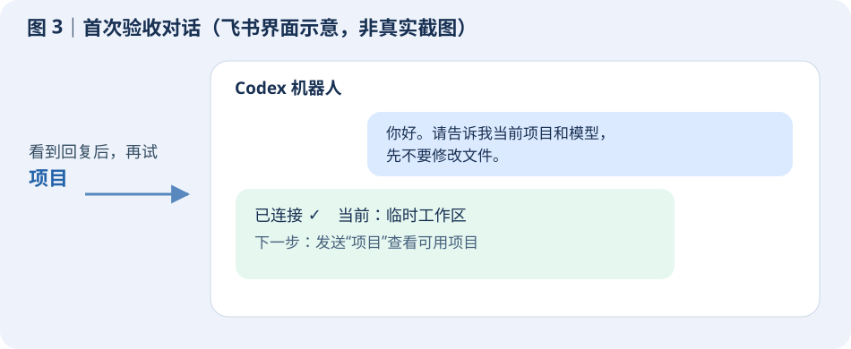
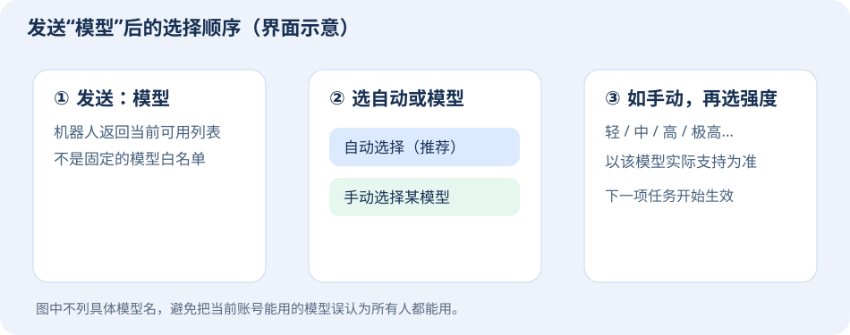

# 把 Codex 带进飞书：从安装到日常使用

这是一份给使用者看的手册，只介绍 **Codex 飞书机器人**。秋招看板是另一个独立产品。你可以先读前两节了解它，再从“第一次接通”跟着做。文中的图片是操作示意；飞书界面名称可能随版本略有不同。

## 它能帮你做什么

这个机器人给 Codex 增加了一个飞书聊天入口：在手机或电脑飞书里发文字、截图和文件，让它处理指定项目，再从飞书收到答复或成品。你不必始终守在开发电脑前，也能在同一段对话里补充要求、暂停工作和查看结果。如果把机器人放在常开的服务器上，自己的电脑关机后仍可使用；放在 Windows 电脑上，则电脑关机后暂时不能回复。

它并不会自动拥有你所有电脑文件的访问权。**机器人在哪台机器运行、当前选了哪个项目**，决定了它能处理什么。工作中涉及修改文件、部署或对外发送时，你仍应把范围和确认条件说清楚。


## 先学会和它合作

第一次聊天，先试一件不改文件的小事。在飞书里发：

```text
请告诉我你现在在哪台机器工作、当前是什么项目和任务。先只读检查，不要修改文件。
```

收到回复后，再给一个真实的小任务。像“帮我看看登录页为什么打不开，先分析原因，不要改代码”比“修一下”更容易得到可核对的结果。复杂任务可以按 **讨论 → 确认 → 执行 → 验收** 进行：先让它说方案；你同意后再让它改；最后要求它说明改了什么、是否测试、还剩什么风险。

进行中可以继续发消息补充条件。想让当前工作停下，发 `暂停`，收到“已中断当前任务”才算停止；已经写入的文件不会因此自动撤销。之后发“继续刚才的工作，先检查已完成的部分”即可重新开始，不要默认它从中断的那条命令原地续跑。

它会显示进度和结果；若嫌过程摘要太多，发 `过程 关`，想再看就发 `过程 开`。这里开关的是**简要过程摘要**，不是完整的模型内部思考记录。

## 第一次接通：先创建飞书机器人，再连接 Codex

以下以 **Windows 电脑本地运行** 为主：你已经能在这台电脑使用 Codex 或 WorkBuddy，机器人也在这台电脑运行。首次配置需要可登录的飞书账号、可用的 Codex，以及能运行安装命令的 Windows 电脑。飞书租户若有限制，可能还要管理员批准。登录、扫码、授权由你完成，其余步骤可以交给电脑端的编码助手。

### 第 1 步：让电脑端助手带你创建机器人

打开电脑上的 Codex 或 WorkBuddy，开始一段新对话，把下面整段发给它。这段话会要求它**先创建或选定你的飞书机器人，再连接到当前电脑**；你不需要自己先学 Git 命令。

```text
请帮我在这台 Windows 电脑配置自己的 Codex 飞书机器人。
项目地址：https://github.com/2609086461/codex-feishu-bot
先阅读项目的 USER_GUIDE.md、AI_SETUP.md 和 AGENTS.md，并检查 Windows 脚本。
第一步先问我要“新建飞书机器人”还是“使用我指定的已有机器人”。
随后协助完成飞书应用创建或选择、登录授权、机器人和消息权限配置、
把飞书应用连接到本机 Codex、启动服务，并在飞书私聊中验收。
请按这台电脑的真实目录调整配置，不要照搬仓库里的示例或维护者路径。
只有登录、扫码、管理员审批或多个应用需要我选择时才让我接手。
不要显示或提交密钥；默认只允许我私聊使用，不要开放群聊。
最后告诉我：机器人叫什么、是否开机自动启动、怎样暂停和重新启动，
以及飞书私聊验收是否成功。
```

助手问“新建还是使用已有机器人”时，第一次通常回答“新建”。若你已经有一个专用飞书应用，可以指定它；不要让助手猜应该接管哪一个。

### 第 2 步：完成飞书登录与授权

助手会带你到飞书开放平台建立企业自建应用，启用机器人、消息权限和消息事件。你可能要扫码登录、完成验证，或等待管理员审批。需要你操作时，按它的提示完成即可。**不要把 App Secret、Codex 登录文件或验证码贴进飞书聊天或公开截图。**

连接成功后，助手应能说清：应用已经发布、消息连接已建立、服务正在 Windows 上运行。只看到“安装命令成功”还不算完成。

### 第 3 步：在飞书私聊验收

打开飞书，找到刚创建的机器人，私聊发送：

```text
你好。请告诉我当前项目和模型，先不要修改文件。
```

你应收到正常回复。再发 `项目`，应看到可选择的项目卡片。两项都通过，才算接通。



如果收不到回复，先不要反复新建机器人。把**发消息的时间、是私聊还是群聊、有没有错误提示**告诉安装助手，让它检查应用是否发布、消息连接和 Windows 后台服务。

### 想让它一直在线？

本地 Windows 版可以设置登录电脑后自动启动；安装助手应向你确认是否启用。它不要求你每次手动打开窗口，但**电脑仍需开机、联网并登录到相应 Windows 用户**。若希望电脑关机后也能用，可以让助手将已跑通的机器人迁到云服务器：先准备服务器上的 Codex 登录和项目文件，再停本地、启云端，最后重新做一次飞书私聊验收。两边不要同时用同一个飞书应用接收消息。

## 日常使用：先选项目，再在项目里继续任务

可以把“项目”理解成一套文件或资料，把“任务”理解成这套资料里的一段独立对话。一个项目里可以有“修登录页”“整理需求”两项任务；切换任务不会复制出第二份项目文件。


发 `项目` 查看当前有哪些项目，点卡片即可切换；发 `任务` 查看当前项目里的对话。想从零开始，发 `新建项目 毕业设计`，再发 `新建任务 整理开题报告`。下次发 `项目`、`任务` 就能切回来。正在执行时先让任务完成或发 `暂停`，再切换。

如果你已经在这台 Windows 电脑上用 Codex 做某个项目，**先发 `项目` 看它是否已列在“本地 Codex 项目”中**，有就直接选，不必重新建。没有的话，把项目所在文件夹告诉机器人，先让它只读检查是否能访问；必要时请安装助手把该路径加入机器人可访问范围。相同账号不代表不同机器自动共享文件或旧聊天。

若机器人在服务器上，你电脑里的文件不会自动出现在服务器。最常见的做法是把可共享的代码和文档放在**私有代码仓库**，让服务器机器人接入；电脑端上传新改动后，飞书里发 `同步项目` 拉取。聊天记录、密码和本地未上传的文件不会随代码自动同步。已有项目的长期背景可写进项目文档或 `AGENTS.md`，这样新任务也能读到；另一个任务里的口头聊天不会自动变成项目记忆。

## 调整模型、过程和交付方式

发 `模型`，在卡片里选“自动”或你账号当下可用的模型；手动选择后再选思考强度。列表来自**机器人运行机器上的 Codex**，会随账号和版本变化。电脑端看得到某模型、飞书里看不到时，先确认两边是不是同一运行环境与账号；必要时检查机器人端 Codex 版本，再发 `模型`。一般先用“自动”即可。



图片和文件可以直接发给机器人，同时说明你想让它做什么，例如“读这张报错截图，先判断原因”。需要可下载的成品时，明确说“完成后把文件发回飞书”。机器人给出的本地文件路径不是你手机上的下载链接；请以实际收到的飞书文件或可访问的云文档链接为准。

## 定时任务能做吗？

能做，但目前**没有在聊天里输入一句“每天 9 点执行”就自动保存计划的内建管理页**。Windows 可由安装助手使用系统“任务计划程序”；云服务器可使用系统定时器。让它先提出“执行时间与时区、要做什么、需要哪些权限、结果发到哪里、如何停用”，你确认后再建立。先做一次手动测试，确认不会重复发消息或越权操作。

例如可以这样问：

```text
我想每天北京时间 9 点检查这个项目的待办，并把摘要发回这个飞书私聊。
先告诉我需要的权限、计划任务如何运行和如何停用；不要立即创建。
```

Windows 版“登录后自动启动机器人”也使用系统任务计划程序，但那只是让**机器人保持在线**，不是替你设好了上述每日工作。

## 更新与恢复：先分清更新的是什么

**项目文件更新**：电脑端改完并上传到自己的代码仓库后，飞书里切到对应项目，发 `同步项目`。它只拉取项目内容，不升级机器人。若机器人已有未提交修改，它会停止保护文件；先让它只读检查改动，不要强制覆盖。

**机器人程序更新**：代码有新版时，先让机器人或电脑端助手检查变更、运行状态和备份；你确认后再更新并重启，最后用飞书私聊验收。目前没有默认开启的机器人新版自动提醒，不应把“自动检测更新”当成每个用户都已有的功能。

**Codex 组件更新**：它可能改变机器人能选的模型。云服务器有一个**可选**的每周检查与飞书提醒：有新版时提醒你决定，默认不自动升级。Windows 电脑和云服务器各有自己的安装版本，更新其中一台不会自动更新另一台。确认升级后，应重新检查 `模型` 和私聊回复。

机器人重启期间正在执行的工作会被中断；服务恢复后，通常会提示你回复 `继续`。继续前最好让它检查已写入的文件，再完成剩余工作。升级或迁移前，先保护项目文件、机器人私有配置和运行状态；不要把密钥、登录态或聊天快照传到公开仓库。

## 出问题时先看这四件事

**完全不回复**：运行机器是否开机联网？飞书应用是否已发布？你是不是在私聊？安装助手可继续查服务日志与消息连接。

**找不到电脑上的项目**：先发 `项目`；如果没列出，核对机器人实际运行在哪台机器，以及它能否访问该文件夹。云端尤其需要先同步文件。

**任务停不下来或重启后断了**：发 `暂停` 并等确认；重启后的中断任务发“继续，但先检查已完成部分”。不要把暂停当作撤销。

**换模型或收文件失败**：发 `模型` 看机器人端的实时列表；文件没收到就要求“通过飞书发送文件”，不要只接受工作区路径。

求助时说明“发生时间、当前项目与任务、你发了什么、机器人回了什么”。**不要附上 App Secret、验证码、完整日志里的密钥或 Codex 登录文件。**

## 需要自己维护时再看

仓库地址：https://github.com/2609086461/codex-feishu-bot 。给编码助手看的部署与维护细节在 `AI_SETUP.md`，安全边界在 `SECURITY.md`。云服务器部署、私有仓库接入和组件周更提醒属于进阶操作；第一次使用只需完成“建立机器人 → 连接当前电脑 → 飞书私聊验收”。
